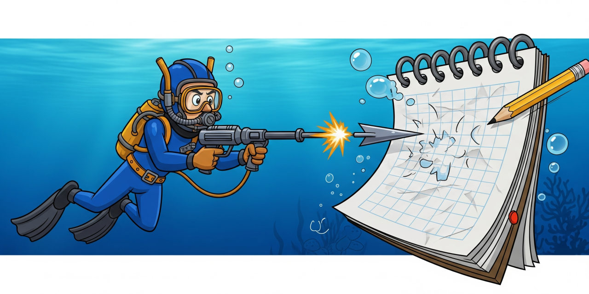

# DaveSaveEd - Dave the Diver Save Editor



A fan-made, open-source save editor for the game *Dave the Diver*. This tool allows players to modify certain aspects of their save game data, such as currency amounts and ingredient quantities.

## Download the Latest Release

The easiest way to use DaveSaveEd is to download the pre-compiled executable.

* **[Download the latest release from GitHub Releases](https://github.com/FNGarvin/DaveSaveEd/releases/latest)**

  * *(Note: The link above will automatically redirect to the latest available release. Look for the `.zip` file under the "Assets" section of the release.)*

## Disclaimer

**This project and its creators are not affiliated with Mintrocket, Nexon, or any other entities associated with the game _Dave the Diver_. This is an independent fan-made tool and is not officially supported or endorsed.**

**Use at your own risk.** Always back up your save files before making any modifications. The editor attempts to create backups automatically, but manual backups are always recommended.

## Features

* **Currency Editing:** Easily maximize Gold, Bei, and Artisan's Flame.
* **Ingredient Management:**
    * Maximize quantities of ingredients you already own.
    * Add and maximize quantities for all known ingredients in the game.
* Automatic save file backup before writing changes.

## Running the Application (Pre-built)

1.  **Download:** Get the latest `DaveSaveEd_Release_vX.Y.Z_Win64.zip` file from the [GitHub Releases page](https://github.com/FNGarvin/DaveSaveEd/releases/latest).
2.  **Extract:** Unzip the downloaded file to a location of your choice (e.g., `C:\Games\DaveSaveEd`).
3.  **Launch:** Navigate to the extracted folder and launch `DaveSaveEd.exe` or run it via the Windows Run command (Windows key + R).

    For verbose logging to a file (`DaveSaveEd.log` in the application's directory), run it from with the `-log` argument:
    ```bash
    DaveSaveEd.exe -log
    ```

## How to Use
::TODO::Create an animation of our app as a cursor moves to and clicks on the max bei option and display it here.
1.  **Launch `DaveSaveEd.exe`**.
2.  **Load Save File:** Click "Load Save File..." The editor will attempt to automatically locate your game's save directory and pre-select the most recent save file (`GameSave_00_GD.sav`). **It's crucial to load this specific file.** Unless you explicitly intend to modify an older, inactive save, simply click "Open" without changing the pre-filled filename.
3.  **Modify Values:** Use the "Set to Max" buttons for currency or the ingredient modification buttons to apply changes.
4.  **Write Save File:** Click "Write Save File" to save your changes. A backup of your original save will be automatically created in temporary storage, in case you need to revert.

---

## Troubleshooting

* **"Failed to load or parse save file!"**:
    * Ensure "Dave the Diver" is not running when you try to load the save file.
    * Verify you've selected a valid `GameSave_XX_GD.sav` file.
    * Check the `DaveSaveEd.log` file for more detailed error messages.
* **Application crashes or misbehaves**:
    * Always ensure you're using the latest version of the editor.
    * Report issues on the GitHub issue tracker.
* **In-game issues after modifying**: Restore from a backup. The editor creates timestamped backups in a `backups` folder next to your save file.
* **Modifications (especially Gold, Bei, Artisan's Flame, or Follower Count) are not visible in-game even after writing the save:**
    * **Incorrect Save File:** The game typically uses `GameSave_00_GD.sav` as its current save. Ensure you loaded and modified this file, and not an older one like `m_GameSave_01_GD.sav`. The "Load Save File..." dialog pre-selects the latest active save; generally, you should just click "Open" after launching it.
    * **Early Game Scripting:** During the game's initial tutorial phases (e.g., Day 1, before you repair the sushi bar or unlock the full restaurant management system), certain values like Gold or Follower Count are hard-scripted and may override changes you make in the save file. For example, your gold will remain -100 until the sushi bar quest is completed. We recommend progressing past these initial scripted sequences before expecting your modifications to take full effect.
    * Always check the `DaveSaveEd.log` file (run with `-log` as described above) for detailed operation reports.
---

## Building from Source (For Developers)

### Prerequisites

To build this project, you will need:

* **Microsoft Visual C++ (MSVC) compiler and build tools:** These are included with **Visual Studio 2017 or newer**, or can be obtained via the **standalone C++ Build Tools for Visual Studio**. This provides `cl.exe` (the compiler), `link.exe` (the linker), and `nmake.exe` (the build utility for the Makefile).

### Building from Source

1.  **Clone the repository:**
    ```bash
    git clone [https://github.com/FNGarvin/DaveSaveEd.git](https://github.com/FNGarvin/DaveSaveEd.git)
    cd DaveSaveEd
    ```
2.  **Build:**
    Open a **Developer Command Prompt for VS** (or an environment where `nmake.exe`, `cl.exe`, and `link.exe` are in your PATH). Navigate to the project root and run:
    ```bash
    nmake
    ```
    This will compile the project and place the executable in the `bin/` directory.

## Contributing

Contributions are welcome! Please feel free to open issues for bug reports or feature requests, or submit pull requests.

---

## License

This project is licensed under the MIT License - see the [LICENSE](LICENSE) file for details.

---

## Credits and Third-Party Libraries

This project uses third-party libraries under their respective licenses:

* **zlib** (Zlib License)
* **nlohmann/json** (MIT License)
* **SQLite** (Public Domain)

Full license texts for these libraries are provided in the `/dist/zlib`, `/dist/nlohmann_json`, and `/dist/sqlite3` directories within this repository.
